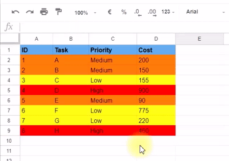
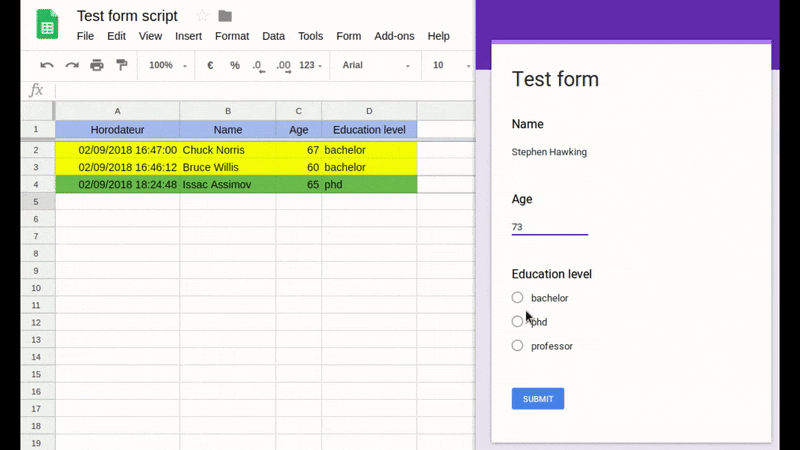
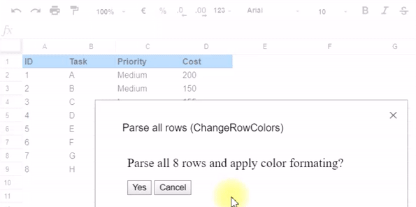
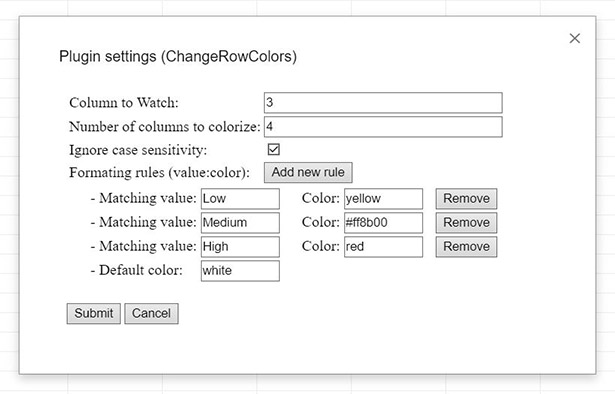

# Change rows colors in google spreadsheets

A plugin to automatically change lines colors in a google spreasheet after update or form submission, if a certain column contains a certain value.

## Table of Contents  
[1. Description](#description)

[2. Examples](#examples)

[3. How to use?](#how-to-use)

[4. How to install for users?](#install-users)

[5. How to install for developpers](#install-dev)

[6. Feedback / Rating](#feedback)

[7. Contributing](#contrib)

 

# <a name="description">Description</a>

ChangeRowColors is a google form/spreadsheet plugin that change the background color of each line when you insert or update it (manually or after a form submission)

The plugin will check a certain column and check its value, then apply a choosen background color to the line according the to column's value. This helps to visually separate between the lines, which is helpful for long todo lists, form submissions, stock inventories...ect.

## <a name="examples">Examples</a>

**1. Manual edit example:**

**2. Form submission:**

**3. Colorizing an already existing document:**

# <a name="how-to-use">How to use?</a>

After installing and activating the plugin, a new menu is created for the plugin settings:

## I. Automatically change line colors:
1. Open the settings panel from the plugin's menu (Add-ons > ChangeRowsColor > Setting).

    A window will appear letting you specify some settings:

    

- Formating rules: let you specify which `color` to apply to the lines containing the specified `value`.
In case none of these values are found in the `watching column`, the `defaultColor` will be applied. 
- Watching column: the number of the column that the plugin will check to look for the matching values.
- Number of columns: the number of columns in each line that will be colorized.
- Ignore case sensitivity: if checked, the plugin will consider uppercase and lowercase characters as similar.

2. At each modification or line insertion (including incoming form answers), the plugin will automatically check the `watchingColumn`'s value and apply the corresponding color.

Note: You can use color names (red, cyan, green...) or hexadecimal codes (#ff02a3..) in the settings panel.

3. You can find a quick video demonstration for using the plugin here
https://www.youtube.com/watch?v=NqZrslI7jAU

## II. Parse all document and change line colors:

You can force the plugin to check all the lines and check the color formating by cliking on the `Parse all rows` button in the plugin's menu.
 
This operation is useful if you installed the plugin in an already filled spreadsheet, but may take few moments depending of the size of the document.

# <a name="install-user">How to install for users?</a>

If you just want to use the plugin:
1. Open your google spreadsheet or create one in your google drive
2. Open `Get add-ons` from `Add-ons` menu (Add-ons > Get add-ons)
3. In the search bar type `Change Rows Color`
4. Install the plugin (click `Free` button) and accept the request access 

**IMPORTANT: the plugin is actually under review by Google's team, it will be publicly available in the Chrome Web Store in the following days**

Note: We do not use, collect, send or store your data, we don't even have access to it :p 

# <a name="install-dev">How to install for developers?</a>

Follow these instruction if you want to change the code and test your modifications:
1. Open your google spreadsheet or create one in your google drive
2. Open the spreadsheet script editor from the menu (Tools > Script Editor)
3. Create a new project
4. Create a script file
5. Copy the content of the script from this repository to the file you created in your Spreadsheet script editor
6. Repeat 4 and 5 for every .gs and .html file in this repository (make sure the .html files have the same name as in this repository)
7. Execute the function `OnInstall()` in the `ConfigDialogBox.gs` script to make sure the document properties and menus are created

# <a name="feedback">Feedback / Rating</a>

Help us increasing the visibility of the plugin by rating the plugin in the the [Chrome Web Store](https://chrome.google.com/webstore/detail/nhppkfffhpjlfpdjhllmoeekmnfeccob).

Your feedback is highly important to help us improve the plugin. Do not hesitate to write your feedback comments in the Chrome Web Store and report any bug in the [issues section of this repository](https://github.com/amineHorseman/change-rows-colors-in-google-spreadsheets/issues).

# <a name="contrib">Contributing</a>

Some ideas for interessted contributors:
- Change the design of the plugin settings window
- Improve the documentation (Rephrase, copywrite, translate, include more examples)
- Add conditional rules (if value greater/lower than a value)?
- Add style formating rules (change text color, font & size)?
- Add multiple watching columns feature?

Feel free to add or suggest more ideas.
